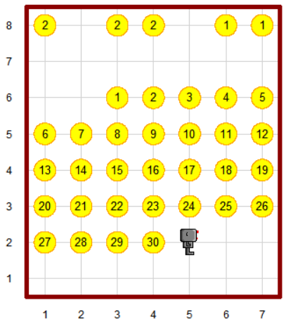

# Assignment - Hubo Calendar
휴보를 이용하여 달력을 만들어보자.

아래 그림은 2022년 11월 달력을 휴보를 이용하여 그린 것이다.

이를 참고하여 다음 조건에 맞게 [hubo_calendar.py](./hubo_calendar.py)를 완성해보자.

1. 가장 윗 줄에는 년도와 월을 beeper를 이용하여 표시한다.
2. 숫자 0에 해당하는 자리는 beeper를 놓지 않아도 된다.
3. 년도와 월 사이에는 공백 한 칸을 둔다.
4. 월이 한 자리인 경우, 앞에 0이 생략된 것으로 간주한다. 즉, 1월은 01월, 2월은 02월로 취급한다.
5. 위에서 두 번째 줄은 건너 뛴다.
6. 위에서 세 번째 줄부터 날짜를 beeper를 이용하여 표시한다.
7. 이때, 가장 왼 쪽 줄이 일요일을 나타내며 차례로 월, 화, 수, 목, 금 그리고 토요일을 나타낸다.

## Hint
* 년도는 1000년부터 9999년까지만 테스트하니 복잡하게 구현하지 말자.
* 어떤 년도가 윤년인지 확인하는 방법: https://learn.microsoft.com/ko-kr/office/troubleshoot/excel/determine-a-leap-year